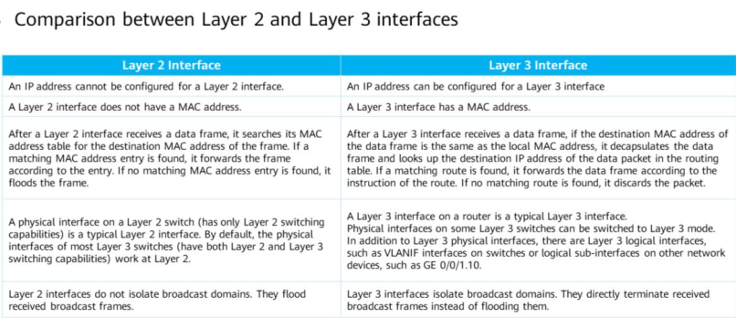

`10.1 Background`

## Inter-VLAN Communication

- In real-world networks, different IP address segments are assigned to different VLANs
- PCs on same network segment can directly communicate. Known as Layer 2 communication
- Inter-VLAN communication is Layer 3, across network segments
- Implemented by connecting a Layer 2 switch to a Layer 3 interface. Communication packets are routed by the Layer 3 interface

`10.2 Implementing Inter-VLAN Communication Using Physical or Sub-interfaces`

### 1\. Using Routers' Physical Interface
- The layer 3 interfaces of router function as gateways to forward traffic between network segments
- Layer 3 interface cannot process frames with VLAN tags. Therefore, switch interfaces connected to router must be set to access type
- One physical interface can function as gateway to only one VLAN
- Scalability is poor, as more VLANs require more interfaces
### 2\. Using Routers' Sub-interfaces
- A *sub-interface* is a logical interface created on a router's Ethernet interface
- Is identified by a physical interface number and a sub-interface number
- Sub-interfaces do not support VLAN packets and discard them once received
- To solve this, VLAN tag termination is implemented on sub-interface
	- Remove VLAN tags from received packets before forwarding or processing
	- Add VLAN tags to packets before forwarding
- Multiple sub-interfaces can be created on one physical interface
- Set switch interface to trunk or hybrid to permit packets carrying VLAN tags
- After connecting the physical interface to the trunk interface of the switch, the physical interface can provide Layer 3 forwarding for multiple VLANs

### Sub-interface Configuration
1. **interface** *interface-type interface-number.sub-interface number* - Creates a sub interface. Sub interface number is generally same as VLAN ID to be terminated
2. **dot1q termination vid** - Enables Dot1q VLAN tag termination for single-tagged packets. Not enable by default
	- Cannot forward broadcast packets, discards upon receipt. To allow broadcast, run **arp broadcast enable**

`10.3 Implementing Inter-VLAN Communication Using  VLANIF`
- Layer 2 switch provides only Layer 2 switching functions
- Layer 3 switch provides Layer 3 and Layer 2 routing functions
- A **VLANIF** interface is a Layer 3 logical interface that can remove and add VLANs
- VLANIF interface number is the same as corresponding VLAN ID
```
-> Each time a packet passes through a layer 3 device, SMAC and DMAC addresses change
-> Packet is decapsulated by switch before being sent to routing module, and re-encapsulated when received from routing module on other end
```
