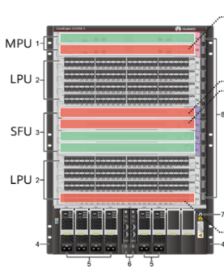

`11.1 Network Reliability Requirements`
- Network reliability refers to the capability of ensuring nonstop network services when a single/multiple points of failure occur on a device or link
- Can be implemented at card, device and link levels
## Card Reliability

A modular chassis consists of the following
- **Chassis** - Provides slots for various cards and modules to implement inter-card communication
- **Power Module** - Power supply system
- **Fan Module** - For heat dissipation
- **Main Processing Units(MPUs**) - Responsible for control plane and management plane of the system
- **Switch Fabric Units(SPU)** - Responsible for the data plane. Data plane provides high-speed non-blocking data channels for data switching b/n modules
- **Line Processing Units(LPU)** - Provides data forwarding functions on a physical device. Provides optical and electrical interfaces of different rates
* * *
- Failure of one MPU does not affect management and control platform
- Failure of some SFUs does not affect data forwarding
- Failure of LPU affects data forwarding on LPU interfaces

## Device Reliability
- A downstream switch is dual-homed to 2 upstream switches.
- Links work in active/backup mode. If active link fails, traffic is switched to backup link

## Link Reliability
- Multiple physical links deployed b/n devices
- STP configured to ensure traffic is forwarded on one link only, others act as backup links

`11.2 Principle and Configuration of Link Aggregation`
- A link aggregation group (LAG) is a logical link formed by bundling several links
- Each LAG has one logical interface, known as Eth-Trunk Interface
- Physical interfaces that constitute an Eth-Trunk are called *member interfaces*, with corresponding *member links*
	- Member interfaces must have the same parameters for
		- Interface rate
		- Duplex mode
		- VLAN configurations
	- Active interface is a member interfaces that take part in data forwardin
	- Inactive interfaces are also known as unselected interfaces
- Link Aggregation mode can be
	- Manual
	- LACP mode

## Manual Mode
- All member interfaces are manually configured.
- Links are usually all active links. If one link is faulty, traffic is shared evenly among other links
- Can be used if one device on both ends of a LAG does not support LACP

**Defects**
- All peer interfaces should be added to the same Eth-Trunk to work properly. Devices do not exchange packets, so this must be manually confirmed
- Device can only determine whethe peer interface is working based on physical layer status

## LACP Mode
- Devices exchange Link Aggregation Control Protocol Data Units(LACPDUs) to ensure peer interfaces are member interfaces that belong to the same device and are on same Eth-Trunk
- An LACPDU contains
	- **Device/System priority** - Used to select the Actor. Smaller value is preferred. Default value is 32768
	- **MAC address** - Used to select the Actor if device priority is the same. Smaller value is preferred
	- **Interface priority** - Used to select active interfaces. Smaller value is preferred. Default is 32768
	- **Interface number** - Used to select active interfaces if interface priority is the same. Smaller value is preferred