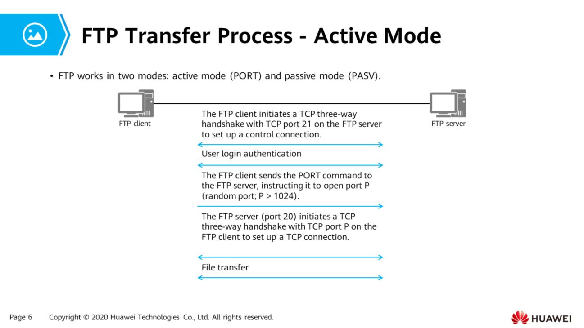

This chapter describes common network services and applications such as FTP, DHCP, and HTTP.

# 1\. File Transfer

`1.1 File Transfer Protocol(FTP)`

- FTP adopts the client/server(C/S) architecture. After an FTP client establishes a TCP connection with an FTP server, files can be uploaded and downloaded.
- FTP uses different transfer modes based on the file type:
    - **ASCII mode** : For text file transfer (TXT, LOG, CFG). Sender converts characters into ASCII code format. Receiver converts it back into characters. Is converted to improve transfer efficiency. Recommended for transferring config and log files of network devices.
    - **Binary mode** : Non-text files such as executables and images (CC, BIN, EXE, PNG) are transferred in binary mode. Can transfer files without conversion. Recommended for transferring version files of network devices.

FTP has 2 modes:

1.  Active mode (PORT)
2.  Passive mode (PASV)

## Active Mode (PORT)

- FTP client uses a random port w/ no. greater than 1024 to send a connection request to port 21 of FTP server.
    
- FTP server sets up a control connection with the FTP client to transmit control messages. FTP client starts to listen on port P (another random port w/ no. greater than 1024) and notifies FTP server using PORT command.
    
- When data need to be transferred, FTP server sends a connection request from port 20 to port P of the FTP client to establish a TCP connection for data transmission.
    
    
- FTP client initiates TCP three-way handshake with TCP port 21 on FTP server to set up a control connection
    
    - - User login authentication
- FTP client sends PORT command to the FTP server and notifies it to open port P (random port; P > 1024)
    
- FTP server (port 20) initiates TCP three-way handshake with TCP port P on the FTP client to set up a TCP connection
    
    - - File transfer

## Passive Mode (PASV)

- FTP client initiates a TCP three-way handshake with TCP port 21 on FTP server to set up a control connection.
- - User login authentication
- FTP client sends the PASV command
- FTP server sends the Enter PASV command to the FTP client, instructing it to open port N (random port; N > 1024)
- FTP client initiates a TCP three-way handshake with TCP port on N on the FTP server to set up a TCP connection
- File transfer

* * *

Active mode (PORT)
FTP client initiates TCP three-way handshake with TCP port 21 on FTP server to establish control connection
User login authentication
FTP client sends PORT command and instructs FTP server to open port P (random port; P > 1024)
FTP server (port 20) initiates TCP three-way handshake with TCP port P on FTP client to establish TCP connection.
File transfer

Steps

1.  Control connection
2.  User login authentication
3.  PORT
4.  TCP connection
5.  File transfer

Passive mode (PASV)
FTP client initiates a TCP three-way handshake with TCP port 21 on FTP server to establish a control connection
User login authentication
FTP client sends PASV command to FTP server
FTP server sends Enter PASV command to the FTP client and instructs it to open port N (random port; N > 1024)
FTP client initiates TCP three-way handshake with port N on FTP server and establishes a TCP connection
File transfer

Steps

1.  Control connection
2.  User login authentication
3.  PASV command
4.  Enter PASV command
5.  TCP connetion
6.  File transfer

* * *

~~In active mode, if the FTP client is on a private network and a NAT device is deployed between the FTP client and the FTP server, the port number and IP address carried in the PORT packet received by the FTP server are not those of the FTP client converted using NAT. Therefore, the FTP server cannot initiate a TCP connection to the private IP address~~

In passive mode, the FTP client initiates a connection to an open port on the FTP server. If the FTP server lies b/n the internal zone of a firewall and inter-zone communication between the internal zone and the zone where the FTP client resides is not allowed, the client-server connection cannot be setup

`1.2 Trivial File Transfer Protocol (TFTP)`
- Designed to transfer small files and is easier to implement
- Using UDP (port 69) for transmission
- Authentication not required
- Can only request a file from or upload to the server, cannot view the file directory on the server.

TFTP supports five packet formats:
1. RRQ : read request packet
2. WRQ : write request packet
3. DATA : data transmission packet
4. ACK : acknowledgement packet, used to acknowledge the receipt of a packet from the peer end
5. Error : error control packet

- Do not need to log into the TFTP server, only need to enter the IP address of the TFTP server and the corresponding command
- VRP devices can function only as TFTP clients

# 2\. Telnet
- Used to facilitate device management using commands
- No dedicated cable is required to directly connect to the console port of the Telnet server, as long as the Telnet server's IP address is reachable and Telnet clients can communicate with the Telnet server's TCP port 23.
- The device that can be managed through Telnet is called the Telnet server, device connectiing to the Telnet server is called the Telnet client. Many network devices can act as both the Telnet server and client
- Mainstream network devices, such as access controller(ACs), access points(APs), firewalls, routers etc can function as both
## VTY User Interface
When a user logs in to a device using Telnet, the system allocates a user interface to manage the current session b/n the device and the user.
- User interface type of Telnet is Virtual Type Terminal (VTY) user interface

# 3\. DHCP
## Issues Faced by Manual Network Parameter Configuration
- **Too many hard-to-understand parameters**
	- Common users are not familiar with network parameters and misconfiguration often occurs, resulting in network access failure. Random IP address configuration may cause IP address conflicts
- **Huge Workload**
	- Network administrators centrally configure network parameters, with heavy workloads and repetitive tasks.
	- Network administrators need to plan and allocate IP addresses to users in advance
- **Low Utilization** 
	- On an enterprise network, each user has a fixed IP address. As a result IP address utilization is low and some IP addresses may remain unused for a long time
- **Poor Flexibility**
	- WLANs allow for flexible station access location (STA). When a STA moves from one wireless coverage area to another, the IP address of the STA may need to be reconfigured.
* * *

-DHCP adopts the C/S architecture.
- Hosts do not need to be configured and can automatically obtain IP 