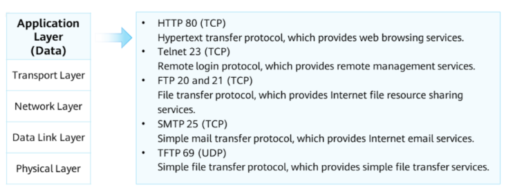
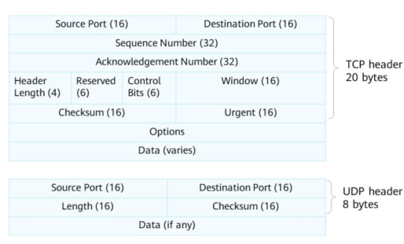

# 1\. Applications and Data

`2.2 Network Reference Model and Standard Protocols`
Open System Interconnection (OSI) reference model - a model for network interconnection. Currenct industry standard is the TCP/IPv4 stack

### Advantages of protocol layering
1. Layers work independently of each other. Layers only need to know the services provided by the upper layer
2. Flexibility. Changes made in each layer do not affect the others.
3. Functions of each layer can be implemented using the most appropriate technology
4. Promotes standardization
5. Breaks complex computer communication problems into multiple simpler problems. Conducive to network troubleshooting
## OSI Reference Model
* * *
7\. **Application layer** :
- Provides interfaces for applications.
 
6\. **Presentation layer** :

- Translates data formats to ensure the application layer data of one system can be identified by that of another.

5\. **Session layer** :

- Establishes, maintains and cancels sessions b/n communicating parties
- Communication is implemented through service requests

4\. **Transport layer** :

- Provides end-to-end services for host communications and transmission
- Controls transmission speed and adjusts data sequences
- Implements error checking before retransmission

3\. **Network layer**:

- Defines logical addresses for routers to determine paths
- Performs routing selection
- Transfers data from source to destination networks

2\. **Data link layer** :

- Encapsulates packets into frames(bits into octects, octects into frames)
- Transmits frames in P2P or P2MP mode
- Implements error checking

1\. **Physical Layer** :

- Interacts with the physical world.
- Transmits bitstreams over transmission media
- Defines electrical and physical specifications (electrical levels, cable pins)
    `APSTNDP`

Each layer provides some service for the upper layer, and depends on the services of the lower layer

- Application layer protocol defines the format of message which is used for the application to transmit and receive the data
- Transport layer is used to transmit the message from end to end
- Network layer exits in both end system and routers. Selects best path for packet transmission
- Data link layer. Provides the one hop transmission
    Translates 0's and 1's into signals, whether electrical or wireless

## TCP/IP Reference Model
* * *
- Combines application, presentation and session layer into Application Layer.
- Can be used for both WAN and LAN
- Model:
	- Application Layer
	- Transport Layer
	- Network Layer
	- Data Link Layer
	- Physical Layer
`ATNDP`
- TCP/IP suite enables data to be transmitted over a network
- Layers use Packet Data Units(PDUs) to exchange data, implementing communication b/n network devices

## Common TCP/IP Protocols
1. Applicaton Layer: 
	- HTTP - Used to access various pages on web servers
	- File Transfer Protocol(FTP) - Provides method for transferring files from one host to another
	- Domain Name Service(DNS) - Translates from host domain names to IP addresses
2. Transport Layer:
	- TCP - Provides reliable connection-oriented communication services for applications
	- User Datagram Protocol(UDP) - Provides connectionless communication. Does not guarantee reliability of packet transmission. Reliability can be ensured by the application layer.
3. Network Layer:
	- Internet Protocol(IP) - Encapsulates transport-layer data into data packets and forwards packets from source sites to destination sites. Provides a connectionless and unreliable service
	- Internet Group Management Protocol(IGMP) - Manages multicast group memberships. Specifically, sets up and maintins memberships between IP hosts and their directly connected multicast routers
	- Internet Control Message Protocol(ICMP) - Sends control messages based on IP protocol. Provides info about problem that may exist in the communication environment
4. Data Link Layer
	- Point-to-Point Protocol(PPP) - A data link layer protocol that works in point-to-point mode. Mainly used on wide area networks(WANs)
	- Ethernet - Multi-access and broadcast protocol at the data link layer. Most widely used for LAN technology
	- Point-to-Point Protocol over Ethernet(PPPoE) - Connects multiple hosts on a network to a remote access concentrator through a simple bridge device(access device). Used for home broadband dialup access

# Application Layer
- Application layer protocol designates transpot layer protocols and ports
- PDUs are called data
**Common Application Layer Protocols**

1. **FTP** 
- Transfers files from one host to another
- Adopts client/server(C/S) structure
- Client - Provides commands for local users to operate files on a remote server
- Server - Provides access and operation functions for remote clients
2. **Telnet**
- Provides remote login services on a network
- Allows user to operate remote devices through local PCs
- Commands entered on client are executed on server
3. **HTTP**
- Provides a method for publishing and receiving HTML pages
- Client visits page on server
- Server returns HTML file of the page

| **Protocol** | **Port Number** |
| --- | --- |
| *FTP* | 20, 21 |
| *SSH* | 22 |
| *Telnet* | 23 |
| *SMTP* | 25 |
| *DNS* | 53 |
| *HTTP* | 80 |
| *POP3* | 110 |
| *IMAP* | 143 |
| *HTTPS* | 443 |

# Transport Layer
- Transport layer protocol receives data from application layer protocol
- Responsible for establishing connections b/n processes on hosts, 
- Encapsulates the data with correspondig TCP header and helps establish an end-to-end(port-to-port) connection
- PDU are called segments
**Transport Layer Protocols Header Formats**

1. **TCP header**
- 20 bytes
- *Source Port* - 16 bits long. Identifies application that sends the segment.
- *Destination Port* - 16 bits long. Identifies application that receives the segment.
- *Sequence Number* - 32 bits long. Value of sequence number field equals sequence number of the first byte in a sent segment.
- *Acknowledgment Number* - 32 bits long. Indicates sequence number of next segment's first byte. Valid only when ACK flag is set. Value is 1 + sequence number of last byte in previous segment received.
- *Header Length* - 32 bits long. Indicates length of TCP header. Default value is 5, indicating that header is 20 bytes.
- *Reserved* - 6 bits long. Must be set to 0.
- *Control Bits* - 6 bits long. Include FIN, ACK, and SYN flags
- *Window* - 16 bits long. Used for TCP flow control. Value is the maxx number of bytes allowed by receiver. Max window size is 65535 bytes.
- *Checksum* - 16 bits long. Mandatory field. Calculated and stored by sender and verified by receiver
- *Urgent* - 16 bits long. Valid only when URG flag is set. Indicates that sender transmits data in emergency mode. Urgent pointer indicates number of urgent data bytes in a segment
- *Options* - 0 to 40 bytes long.
2. **UDP header**
- *Source Port*  - 16 bits. Same as TCP
- *Destination Port* - 16 bits. Same as TCP
- *Length* - Max 65535 bytes. Min 8 bytes(Header occupies 8 bytes). Specifies total length of UDP header and data
- *Checksum* - 16 bits long. Checksum of UDP header and data
# Network Layer
- Responsible for transmitting data from one host to another
- PDUs are called packets
**Working Process of a Network Layer Protocol**
- When IP is used, both parties are assigned a unique IP address
- Encapsulation and forwarding IP data packets
	- Network layer encapsulates IP packet header and adds source and destination address
	- Intermediate network device(eg router) maintains a routing table. After receiving a packet, network device reads the destination address, searches the local routing table for matching entry and forward IP packet
	- Packet reaches destination host. Host determines whether to accept packet based on destination IP address.