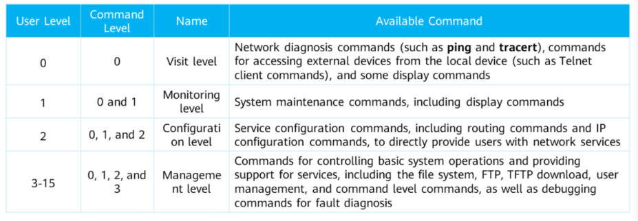
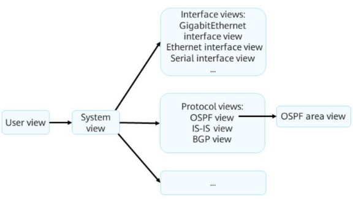

# 1\. VRP Overview
- Versatile Routing Platform(VRP) is a universal OS platform for Huawei datacom products,
- Based on IP and adopts component-based architecture.
- Provides a unified user and management interface
- Implements the functions of the control plane and defines the interface specifications of the forwarding plane
- Implements communication b/n device forwarding plane and VRP control plane
- Eliminates the differences b/n the link layer and network layer
**Development of VRP**
- **VRP1**
- **VRP2**
- **VRP3**
## File System
- Manages files and directories in storage media
- File types and extensions:
	- *System Software* - For device startup and operation, providing support, management and services for a device
		- .cc
	- *Configuration File* - Collection of command lines. Enables a devices to start with configurations in the file
		- .cfg
		- .dat
		- zip
	- *Patch File* - A kind of software compatible with the system software. Used to fix bugs in system software. Can also fix system defects and optimize functions to meet service requirements
		- .pat
	- *PAF File* - Controls products features and resources
		- .bin
- To manage files on a device, log in through:
	- Local login(Console port or Telnet)
	- Remote login(FTP, TFTP or SFTP)
## Storage Media
- Includes SDRAM, NVRAM, SD card, USB, flash memory
	- *SDRAM* - Stores system running information and parameters
	- *NVRAM* - Nonvolatile. Used to store log buffer files
	- *SD Card* - Nonvolatile. Used to store system files, config files, log files etc. Generally installed on a main control board
	- *USB* - Considered an interface. Used to connect to a large-capacity storage medium for device upgrade and data transmission
	- *Flash* - Nonvolatile. Used to store system software, config files, patch files, PAF files etc.
## Device Management
- 2 management modes: CLI and Web
- Web system
	- Provides GUI for easy management and maintenance.
	- Can only be used to manage some device functions
	- Supports HTTP and HTTPS login modes
- CLI
	- Requires users to use command provided by a device
	- Implements refined management but requires familiarity with commands
	- Supports Console port, Telnet, and SSH login modes
### VRP User Interface
- Allocated when user logs in through CLI mode.
- Manages current session b/n user terminal and device
- Can be ***Console User Interface*** or ***Virtual Type Terminal(VTY)*** user interface
- **Console User Interface** 
	- Used to manage/monitor users who log in through console port.
	- Serial port of user terminal can be directly connected to console port of device for local access
- **VTY User Interface**
	- Used to manage user who log in via VTY
	- VTY channel established b/n terminal and device after Telnet or STelnet connection to implement remote access to device
	- VTY is a virtual line port
	- Generally has a max of 15 user logins at a time
### VRP User Levels

- User command level range: 0 to 3
- User level range: 0 to 15
### Login to Web System
- Start browser on a PC
- Enter router IP address(varies according to device) in address bar
- Press Enter
### CLI - Local Login
Used to configure a device that is powered on for the first time
- Use a console cable to connect console port of device with COM port of computer
- Use PuTTY on computer to log in to device
```
PuTTY is a connection software for login through Telnet, SSH, serial interfaces etc
```
### CLI - Remote Login
- If SSH login is used:
	-  Set Connection type to SSH
	-  Enter IP address of remote login server
	-  Use default port number 22
`SSH is disabled by default. Log in through console port to configure mandatory parameters for SSH login first`
-  If Telnet login is used:
	-  Set Connection type to Telnet
	-  Enter IP address of remote login server
	-  Use default port number 23
# 2\. Command Line Basics
```
2.1 Command Line Overview
```
Commands consist of 
- Command word - Specifies the operation to be executed in a command.
- Keywork - Special character string that is used to restrict a command. Can be usd to express command composition logic.
- Parameter list - Composed of parameter names and values. Further restricts command function. Can contain one/more pairs of names and values.
## Command Views

1. User view - Can check running status and statistics of device. Only display/query and tool commands are provided
2. System view - Can set system params and enter config views of other commands
**User-defined Shortcut Keys**
Ctrl+G, Ctrl+L, Ctrl+O, Ctrl+U
`GLOU`
```
In VRP5, a command config takes effect immediately after command is executed. Used by most datacom products.
In VRP8, the configuration command takes effect only after being commited. ```