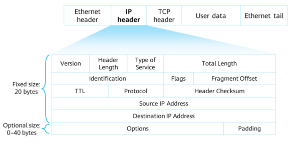

# 1\. Network Layer Protocols

## Encapsulation

- TCP header added to upper-layer data at the transport layer. -> Segment
- Data segment transmitted to network layer. IP header added -> Packet
- Data packet transmitted to data link layer. Data link layer header and tailer added -> Frame
- Frame is converted into bits and transmitted through network media

## IPv4 Packet Format



- *Version* \- 4 bits long. Value 4 indicates IPv4, 6 indicates IPv6
- *Header Length* \- 4 bits long. Indicates size of header. Default length 20 bytes, max 60 bytes
- *Type of Service* \- 8 bits long. Only used when Qos differentiated service(DiffServ) is required.
- *Total Length* \- 16 bits. Indicates total length of packet
- Identification - 16 bits. Carries a value assigned by sender host. Used for fragment reassembly
- *Flags* \- 3 bits long.
    - Reserved Fragment - 0
    - Don't Fragment - 1 indicates fragmentation not allowed, 0 the opposite
    - More Fragment - 1 indicates more segments following, 0 indicates it's the last segment
- *Fragment Offset* \- 12 bits. Indicates relative position of a fragment in original packet. Used with More Fragment bit for fragment reassembly
- *Time to live* (TTL) - 8 bits. Specifies max number of routers a packet can pass through. Reduced by 1 for every router. Packet is discarded if reduced to 0 and an ICMP error message is sent to source IP address.
- *Protocol*: 8 bits long. Identifies protocol used to further process the data packet. Allows IP layer of the destination host to send data to the process mapped to the Protocol field.
    Values:
    - 1: ICMP, Internet Control Message Protocol
    - 2: IGMP, Internet Group Management Protocol
    - 6: TCP, Transmission Control Protocol
    - 17: UDP, User Datagram Protocol
- *Header Checksum*: 16 bits long.
- *Source IP Address*: 32 bits long. Indicates a source IP address.
- *Destination IP Address*: 32 bits long. Indicates a destination IP address.
- *Options*: a variable field.
- *Padding*: padded with all 0s.

# 2\. Intro to IPv4 Address

- 32 bits(4 bytes) long
    `0.0.0.0 to 255.255.255.255`
- Has 2 parts:
    - Network ID - Identifies a network. Devices with same network ID are on the same network regardless of geography.
    - Host part - Uniquely identifies a host

### Classful Addressing

|     | Range | Subnet Mask (Default) | Use |
| --- | --- | --- | --- |
| A   | 0.0.0.0 - 127.255.255.255 | 255.0.0.0 | \- Unicast<br><br>\- Assigned to Hosts |
| B   | 128.0.0.0 - 191.255.0.0 | 255.255.0.0 |
| C   | 192.0.0.0 - 223.255.255.0 | 255.255.255.0 |
| D   | 224.0.0.0 - 239.255.255.255 |     | Multicast |
| E   | 240.0.0.0 - 255.255.255.255 |     | Research |

- Network ID of Class A network is 8 bits. Small number of network IDs, large number of host interfaces
- Network ID of Class B network is 16 bits.
- Network ID of Class C network is 24 bits. Large number of network IDs, small number of host interfaces

```
Multicast address is used to implement one-to-multiple message transmission
```

### Special IP Addresses
* * *
- ***Limited Broadcast Address*** 
	- 255.255.255.255
	- Can be used as a destination address. Traffic assigned to it is sent to all hosts on the network
- ***Any IP Address***
	- 0.0.0.0
	- Refer to source hosts on a network
- ***Loopback Address***
	- 127.0.0.0/8
	- Used to test the software system of a device
- ***Link-local Address***
	- 169.254.0.0/16
	- Used for temporary communication if a host fails to automatically obtain an IP address.

## ICMP
- Used to transmit error and control information b/n network devices.
- Value 1 in Protocol Field of IP header
- Format of an ICMP message depends on Type and Code fields
	- Type indicates a message type
	- Code contains a parameter mapped to the message type
- A message contains a 32-bit variable field. Usually set to 0
	- In a Redirect message, this field indicates the IP address of a gateway
	- In an Echo Request message, this field contains an identifier and a sequence number
### ICMP Redirection
- A type of ICMP control message. Used when router detects that a non-optimal route is used
#### Process
- Host A wants to send packets to server A. Host A sends packets to the default gateway address that is assigned to the gateway RTB.
- After receiving the packet, RTB checks packet information and finds that the packet should be forwarded to RTA. RTA is the other gateway on the same network segment as the source host. This forwarding path through RTA is better than that through RTB. Therefore, RTB sends an ICMP Redirect  message to the host, instructing the host to send the packet to RTA.
- After receiving the ICMP Redirect message, the host sends a packet to RTA. Then RTA forwards the packet to server A.