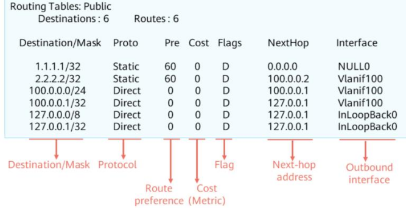

# 1\. Overview of IP Routing
`1.1 Basic Concepts of Routing`
- ***Routes*** are the path information used to guide packet forwarding
- A ***routing device*** is a network device that forwards packets to a destination subnet based on routes.eg - router.
### **Procedure**
- A gateway and router select a path according to the destination address of a received IP packet and forward it to the next router
- The last-hop router performs Layer 2 addressing and forwards the packet to the destination host
`Route-based Forwarding`
* * *
### Routing Entry Information
- *Destination* - Identifies a destination subnet
- *Mask* - Identifies a subnet together with a destination IP address
- *Outbound interface* - Indicates the interface through which data packet is sent out of the local router
- *Next hop* - Indicates the next-hop address used by the router to forward the data packet to destination
```
=> Destination address and mask identify the destination of packet
=> Outbound interface and next-hop specify route
```
- Routers forward packets based on its IP routing table
- Table contains only optimal routes, not all.
- Router manages routing information by managing routing entries in its routing table

## Fields in Routing Table

- *Proto* - Indicates the protocol type of the route
- *Pre* - Indicates the preference of the route. A router selects the route with the lowest preference value(highest preference)
- *Cost* - Indicates the cost of the route. When multiple routes have the same preference, the one with lowest cost is selected. Common metrics are cost, load, bandwidth, hop count, reliability, delay.
`Preference is used to compare routes from different routing protocols`
`Cost is used to compare routes from the same routing protocol. Also known as metric`
### Comparision Process
**Preference**
- RTA compares preference of the 2 routes and selects the one with lowest preference value
- Route is installed in the routing table
**Metric / Cost**
- RTA compares preferences of 2 routes with same protocol.
- Route with lower cost is installed in the routing table
**Default Preference Values**
- *Direct* - 0
- *Static* - 60
- *OSPF internal* - 10
- *OSPF external* - 150
* * *
## Default Routes
- Only used when packets to be forwarded do not match any routing entry
- Default route is 0.0.0.0/0
- Typically used at the egress of an enterprise network.
## 1. Direct Routes
- Auto generated by a device and points to a local directly-connected network
- If packet matches direct route, router checks its ARP entries and forwards packet to destination address based on ARP entry
- Next-hop address is the address of the local outbound interface
- Direct routes for interfaces are installed in IP routing table only if the physical and protocol status of interface is 'up'.
## 2. Static Routes
- Manually configured by network admins
- Have low system requirements
- Apply to simple, stable and small networks
- Cannot automatically adapt to network topology changes
## 3. Dynamic Routes
Dynamic routing protocols are classified into 2 types based on the routing algorithm
1. Distance-vector routing protocol
	- RIP
2. Link-state routing protocol
	- OSPF
	- IS-IS
3. Path vector routing protocol (modded based on distance-vector)
	- BGP
Dynamic routing protocols are classified into 2 types based on application scope
1. IGP - Run within an autonomous system(AS)
	- RIP
	- OSPF
	- IS-IS
2. EGP - Run between different ASs
	- BGP

## Classless Inter-Domain Routing (CIDR)
- Uses IP addresses and masks to identify networks and subnets. Replaces classful network design
- Based on Variable Length Subnet Mask(VLSM)