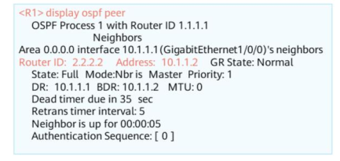
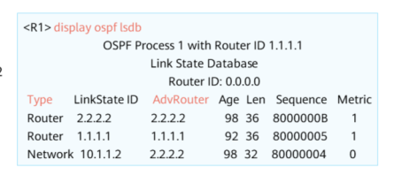
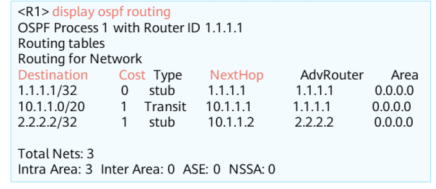

`6.1 OSPF Overview`
## Distance-Vector Routing Protocol
- A router running distance-vector routing protocol periodically floods routes
- Each router learns routes from neighbouring routers and installs the routes into routing table
- Each router is clear only about the destination and how far it is. Has no knowledge of network's topology. This is the core principle of the distance-vector algorithm

## Link-State Routing Protocol - OSPF
- OSPF routers exchange link status information, not routes
- OSPFv2 is designed for IPv4, OSPFv3 is designed for IPv6
- OSPF supports VLSM mechanism and manual route summarization
- Multi-area design enables OSPF to support a larger network
### 1. LSA Flooding
- A link-state routing protocol advertises link status information rather than routes in the routing table
- Each router establishees a neigbour relationship and exchanges Link State Advertisements(LSAs)
- LSAs describe a router interface's status information. ie. interface cost and relationship b/n router and neighbouring routers.
### 2. LSDB Creation
- Each router generates LSAs and stores it in its own Link State Database(LSDB)
- LSDB contains the description of all router interfaces on the network. Also contains description of entire network topology
### 3. SPF Calculation
- Each router uses Shortest Path First(SPF) algorithm and LSDB info to calculate routes
- Each router calculates a loop-free tree with itself as the root and the shortest path. This determines the optimal path to each node on a network
### 4. Routing Table Generation
- Each router install routes into routing table based on
* * *
1. Establish neighbour relationship b/n neighbouring routers
2. Exchange LSA and synchronize LSDB information b/n neighbours
3. Calculate an optimal path
4. Generate route entries based on shortest path tree and load entries to the routing table
## Basic OSPF Concepts
1. **Area**
	- Identifies an OSPF area. 
	- An area is considered as a logical group, each identifies by an area ID
2. **Router ID**
	- A router ID uniquely identifies a router in an OSPF area
	- Router ID can be manually specified or automatically assigned by system
	- Usually manually set to the Loopback interface of the device
3. **Cost Value**
	- OSPF uses cost as route metric values
	- Default value = `100 Mbits/s // Interface bandwidth` 
	- Default cost value of an OSPF Interface
		- FE interface = 1
		- GE interface = 1
		- Serial interface(1.544 Mbits/s) = 64
	- Cost of route = Sum of costs of all inbound interfaces 

## OSPF Packet Types
1. **Hello** - Periodically sent to discover and maintain OSPF neighbour relationships
2. **Database Description** - Describes the summary of the local LSDB. Used ot synchronize LSDBs of two devices
3. **Link State Request** - Requests a needed LSA from neighbour. Is sent only after database description packets have been exchanged
4. **Link State Update** - Is sent to advertise a requested LSA to a neighbour
5. **Link State ACK** - Is used to acknowledge receipt of an LSA
## Types of OSPF Entries
1. Entries in Neighbour Table

	- Describes status of the neighbour relationship b/n OSPF routers
	- Relationships are established by exchanging Hello Packets
2. Entries in LSDB Table

	- LSDB stores LSAs generated by router itself and those from neighbours
	- Type field indicates LSA type
	- AdvRouter field indicates router that sent LSA
3. Entries in OSPF Routing Table

	- OSPF routing table and router routing table are different
	
`6.2 OSPF Working Mechanism`
### Process of Establishing OSPF Adjacency relationship
1. Establish a bidirectional neighbour relationship
2. Negotiate master/slave status
3. Mutually describe LSDB summary information
4. Update LSAs and synchronize LSDBs on both ends
5. Calculate routes (performed separately on each device)
**Step 1**
- When an OSPF router receives the first Hello packet from another router, it changes from `Down state`  to  `Init State`
- When an OSPF router receives a Hello packet which has its router ID in the neighbour field, it changes from `Init state`  to `2-way state`
**Step 2 and 3**
- State changes from `2-way`  to `Ex-start`
- Both routers exchange DD packets
- Router with the higher ID is selected to become the master device