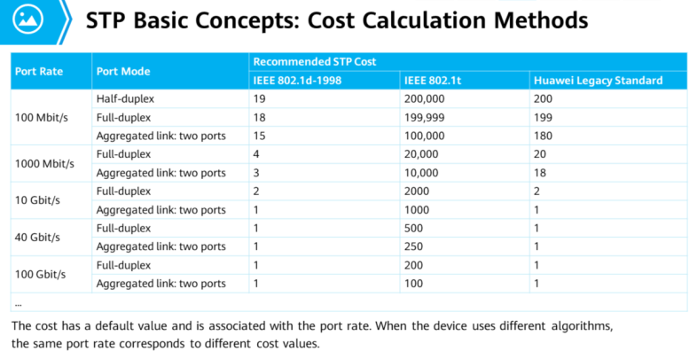
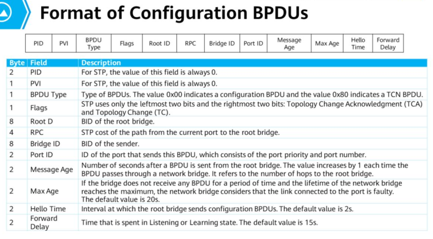

`9.1 STP Overview`
## Issues caused by Layer 2 Loops
1. **Broadcast Storm
	- If a switch receives a broadcast / unicast frame with unknown DMAC, switch forwards the frame to all other interfaces except the source interface. 
	- If a loop exists, the frame is forwarded infinitely
2. **MAC Address Flapping**
	-  A switch generates a MAC address table based on source addresses of received frames and interfaces
	-  If loops exist, same MAC addresses are learnt recurrently as the frames is switched between the same switches
* * * 
- STP is used on a LAN to prevent loops
- STP monitors network status and can respond to topology changes

`9.2 Working Mechanism of STP`
### Bridge ID(BID)
- Consists of 
	- 16 bit bridge priority. Default is 32768. Must be a multiple of 4096
	- 48 bit MAC address
	- Device with smaller priority value is selected as root bridge
	- If priorities are the same, device with smaller MAC address is selected as the root bridge
### Root Bridge
- Root of an STP network
- Is the logical(not necessarily physical) center of the network. It changes dynamically with network topology
- Generates and sends configuration BPDUs to other devices at specific intervals. Other devices process and forward BPDUs to notify lower devices of topology changes
### Cost
- Each port has a cost
- Higher port bandwidth indicates smaller cost
- Cost is used to calculate root path cost(RPC)

### RPC
- Cost from a switch port to the root bridge
- Sum of costs of all inbound ports along a path
- RPC of root bridge is 0
### Port ID(PID)
- Switch used PID to identify ports
- Consists of
	- Port priority. Ranges from 0 to 240. Must be a multiple of 16. Default is 128
	- Port number
### BPDU
- Switches exchange BPDUs where information and parameters are encapsulated to calculate spanning trees
- Classified into
	- **Configuration BPDUs** - Used by STP to select the root bridge by transmitting Configuration BPDUs between switches and ports to determine roles. After network topology is stable, only root bridge sends configuration BPDU

	- **Topology Change Notification(TCN)** - Sent  by a downstream switch to an upstream switch when it detects a topology change.
	
### Comparision Rules
Optimal configuration BPDU is selected in the following order
1. Smallest BID of root bridge - Used to elect the root bridge
2. Smallest RPC
3. Smallest BID of network bridge
4. Smallest PID

## STP Port State Transition
1. *Disabled/Down* - When port is initialized. Cannot send or receive BPDUs or service data frames
2. *Blocking* - Cannot send BPDUs but can listen. Cannot send or receive service data frames or learn MAC addresses. Alternate port
3. *Listening* - Port is elected as root port or designated port. Can send and receive BPDUs but not service data frames. Cannot learn MAC addresses
4. *Learning* - Listens to service data frames but cannot send them. Can learn MAC addresses
5. *Forwarding* - Can send and receive service data frames and BPDUs. Only root or designated ports can enter this state
